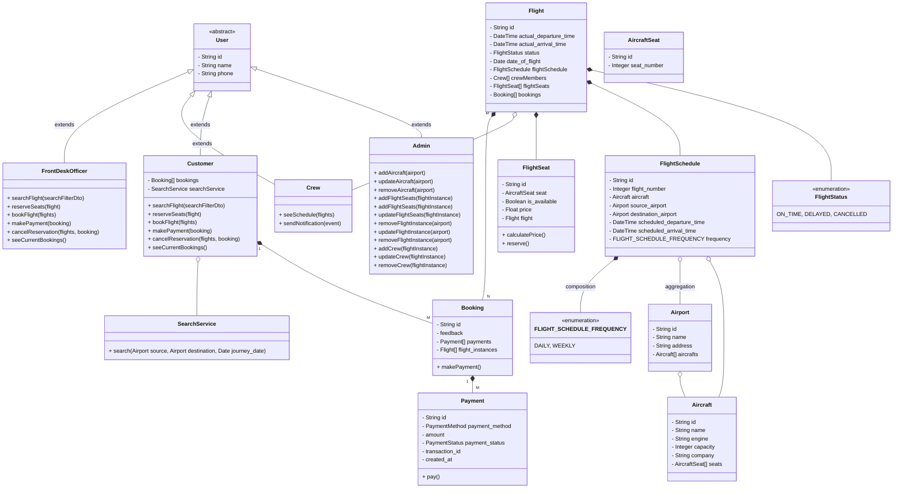
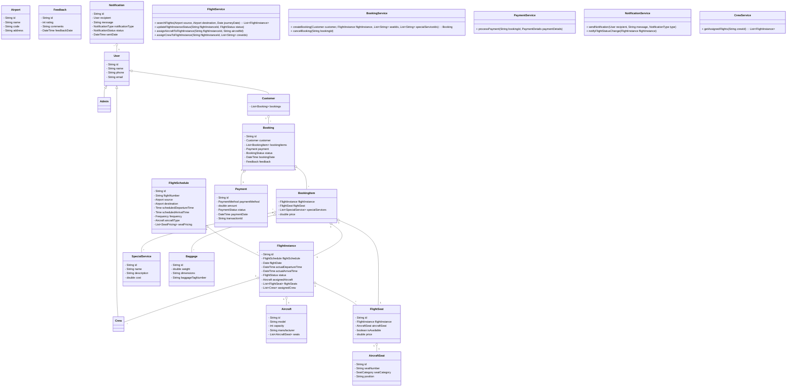

# Design an Airline System

## Requirements:

1. Admin Functions:

	•	Aircraft Management:
	•	Admin can add aircraft to an airport.
	•	Admin can define the capacity and specifications of each aircraft.
    
	•	Flight Management:
	•	Admin can add flights to the system.
	•	Admin can schedule flights with details like source, destination, departure time, arrival time, and frequency.
	•	Admin can update flight status, including delays and cancellations.
	•	When there is a delay in a flight, all other affected flights should be updated.

	•	Crew Management:
	•	Admin can add crew members to the system.
	•	Admin can assign crew to specific flights.
	•	Flight crew receive notifications of any changes to their schedules.

	•	Seat and Pricing Management:
	•	Admin can assign different seat categories (e.g., Economy, Business, First Class) to flights.
	•	Admin can set base prices for each seat category.

	•	Reporting and Analytics:
	•	Admin can generate reports on bookings, cancellations, revenue, and other key metrics.

2. Customer and Front Desk Officer Functions:

	•	Flight Search and Booking:
	•	Can search for flights using filters like date, time, source, destination, etc.
	•	Can book multiple flights at once (e.g., round-trip, multi-city itineraries).
	•	Can reserve multiple seats on a flight.
	•	Can select specific seats during the booking process.

	•	Special Requests:
	•	Can request special services such as special meals, wheelchair assistance, etc.

	•	Payment Processing:
	•	Can make payments using multiple payment options.
	•	Can handle payment failures and process refunds if necessary.

	•	Reservation Management:
	•	Can create itineraries and reserve tickets.
	•	Can cancel reservations.
	•	Can view booking history and details.

	•	Notifications:
	•	Receive notifications a few hours before the flight.
	•	Receive notifications about flight delays, cancellations, gate changes, and boarding times.

	•	Online Check-in:
	•	Can check in online before arriving at the airport.

3. Flight Crew Functions:

	•	Schedule Management:
	•	Can view the schedule of their assigned flights.
	•	Receive notifications of any changes to their flight assignments.

4. System Functions:

	•	Flight Updates and Notifications:
	•	Automatically update all affected flights in case of delays.
	•	Send real-time notifications to customers and crew about flight status changes.

	•	Baggage Management:
	•	Handle baggage allowances and fees.
	•	Track checked luggage.

	•	Security and Compliance:
	•	Ensure secure handling of sensitive information.
	•	Comply with data protection regulations (e.g., GDPR).

	•	Integration:
	•	Integrate with external systems like payment gateways and email/SMS services.
	•	Support multi-language interfaces for international customers.

	•	Scalability and Performance:
	•	Ensure the system can handle high volumes of bookings and searches without performance degradation.

5. Additional Considerations:

	•	User Accounts and Profiles:
	•	Customers can create accounts to save personal information and view booking history.

	•	Customer Feedback System:
	•	Allow customers to provide feedback or rate their experience.

	•	Future Enhancements:
	•	Placeholders for loyalty program integration.
	•	Potential integration with third-party travel agencies.

## Schema Design
Possible Core Entities:
1. Aircraft
2. Airport
3. Flights
4. Baggage
5. Customer
6. Crew
7. Notification
8.  Reports
9.  Booking
10. SpecialService
11. Payment
12. Notification
13. Feedback

AIRCRAFT
- id (pk)
- name
- engine
- capacity
- company
- other attributes

AIRCRAFT_SEAT
- id (pk)
- aircraft_id (fk: AIRCRAFT.id)
- seat_number
- seat_category (e.g., Economy, Business)
- Other attributes

AIRPORT
- id (pk)
- name
- address
- other attributes

AIRCRAFT_AIRPORT_MAPPING
- id (pk)
- AIRCRAFT_id (fk: aircraft.id)
- AIRPORT_id (fk: airport.id)

AIRCRAFT: AIRPORT - M: N

<!-- FLIGHT
- id (pk)
- source (fk: airport.id)
- destination (fk: airport.id)
- start_date_time
- end_date_time
- delay (nullable)
- AIRCRAFT_id (fk: aircraft.id) (nullable)

FLIGHT: AIRPORT - N: 1

FLIGHT: AIRCRAFT - 1: 1 -->

FLIGHT_SCHEDULE:
- id (pk)
- flight_number
- source_airport_id (fk: airport.id)
- destination_airport_id (fk: airport.id)
- scheduled_departure_time
- scheduled_arrival_time
- frequency (e.g., daily, weekly)
- other attributes common to all instances
  

FLIGHT_INSTANCE:
- id (pk)
- FLIGHT_SCHEDULE_id (fk: flight_schedule.id)
- actual_departure_time
- actual_arrival_time
- status (on-time, delayed, cancelled)
- aircraft_id (fk: aircraft.id)
- date_of_flight
- available_seats_count
- other instance-specific attributes

FLIGHT_INSTANCE_SEAT
- id (pk)
- seat_id (fk: SEAT.id)
- FLIGHT_INSTANCE_id (fk: flight_instance.id)
- is_available (boolean)
- price (calculated based on base_price and other factors)
  

FLIGHT_INSTANCE : FLIGHT_SEAT - 1 : N

CUSTOMER
- id (pk)
- name
- phone
- other attributes

CREW
- id (pk)
- name
- phone
- other attributes

FLIGHT_INSTANCE_CREW_MAPPING
- id (pk)
- FLIGHT_INSTANCE_id (fk: flight_instance_.id)
- CREW_id (fk: crew.id)

FLIGHT_INSTANCE : Crew - M : N

BOOKING
- id (pk)
- CUSTOMER_id (fk: customer.id)
- feedback

BOOKING_FLIGHT_INSTANCE_MAPPING
- id (pk)
- BOOKING_id (fk: booking.id)
- FLIGHT_INSTANCE_id (fk: flight_instance.id)
- SPECIAL_SERVICE_id (fk. special_service.id)
- flight_instance_seat_id (fk: FLIGHT_INSTANCE_SEAT.id)
- booked_price
- seat_category

SPECIAL_SERVICE
- id (pk)
- name
- cost
- other attributes

BAGGAGE
- id (pk)
- weight
- BOOKING_id (fk: booking.id)
- tracking_number
- fees

BAGGAGE : BOOKING - N : 1
  
  
PAYMENT
- id (pk)
- payment_method
- booking_id (fk: BOOKING.id)
- amount
- payment_status
- transaction_id
- created_at

Payment: Booking - N : 1

## Class Diagram

## Refined Class Diagram:
